HOL - Feature Flag for a Mobile Solution
=========================================

In this lab you will work with a simple Xamarin Forms mobile application. Your task is to add a feature flag and then bind it to the app's logic.

## Pre-requisites: ##

- Visual Studio 2017

- [Windows SDK and emulator](https://developer.microsoft.com/en-us/windows/downloads/sdk-archive) installed  

- [Android SDK](https://developer.android.com/studio/index.html) and [Java 1.8 JDK](http://www.oracle.com/technetwork/java/javase/downloads/index.html) installed

- [Visual Studio Emulator for Android](https://www.visualstudio.com/vs/msft-android-emulator/ ) installed.

- [Xamarin](https://developer.xamarin.com/guides/cross-platform/windows/visual-studio/) installed and set up for Visual Studio.

	> **Note:** This includes [Mac setup](https://developer.xamarin.com/guides/ios/getting_started/installation/windows/connecting-to-mac/), if you have intentions to run iOS app.

- PartsUnlimited website deployed to Microsoft Azure (see [link](https://github.com/Microsoft/PartsUnlimited/blob/master/docs/Deployment.md))


## Tasks Overview: ##

**1. Clone repository using Git** This task will show you how to clone a repository from github to your machine using a command line with git.

**2. Open and Run the mobile app** In this task you will use Visual studio to open PartsUnlimited's Xamarin solution and a then run it on an Android emulator.

**3. Adding feature flag to the mobile app** In this task you will modify and add code to the Xamarin application to create a discount feature flag.

**4. Validate that feature flag is operational** In this task you will check that discount is applied to the products' prices when the feature flag is toggled.


## Tasks
### Task 1: Clone repository using Git ###
Let's get the PartsUnlimited's source code. If you already have the source code on your machine then skip to the next task.

 Clone the repository to a local directory.

**Step 1.** Open a command line (one that supports Git) and navigate to the directory where you want to store your local repositories. For example you can create and navigate to `C:\Source\Repos`.

**Step 2.** Clone the repository with the following command:

		git clone https://github.com/Microsoft/PartsUnlimited.git

> After a few seconds of downloading, all of the code should now be on your local machine.


### Task 2: Open and run the mobile app ###

**Step 1.** Open Visual Studio as administrator. Open Start menu, locate Visual Studio 2015, right click on it, select "More" and then click on "Run as administrator".


**Step 2.** Open mobile app solution.

1. Click on "File", "Open" and then "Project/Solution".

	

2. Navigate to the directory where you cloned the repository, select "PartsUnlimited.Mobile.sln" and click on "Open".

	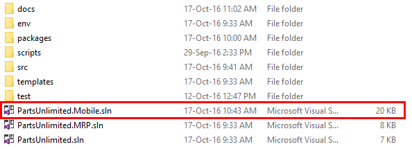

3. If you haven't done so already, you will be prompted to connect to a Mac machine.
	> **Note:** Connection to a Mac machine is only required if you want to compile and run iOS applications. To connect Mac to your Visual Studio instance follow these instructions: [Xamarin: Connecting to the Mac](https://developer.xamarin.com/guides/ios/getting_started/installation/windows/connecting-to-mac/)

**Step 3.** You should be able to build and run the solution on iOS, Android and UWP (Windows Phone 10 or Windows 10). Let's run it on Android emulator.

1. Right click on "PartsUnlimited.Droid" project, then on "Set as StartUp Project".

	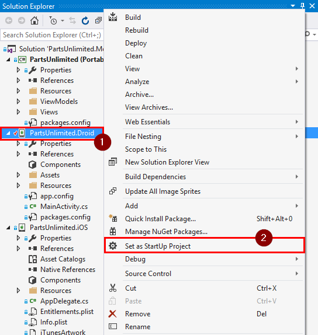

2. Clean the solution. Right click on the solution and select "Clean Solution".

	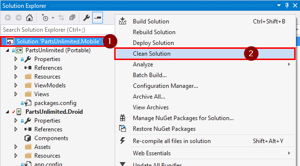

3. Rebuild the solution. Right click on the solution and select "Rebuild Solution".

	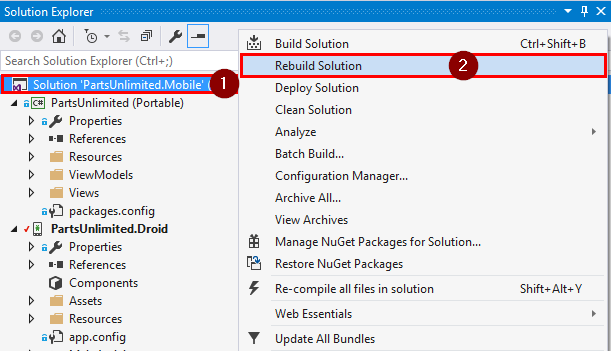

>**Note:**
<br>1) If packages haven't been restored properly then run the following command in Visual Studio's Package Manager Console: `Update-Package –reinstall`
<br>2) If you had multiple Java JDK versions installed at the time of setting up Xamarin, then you have to make sure that Visual studio is using Java SDK version 8 in Tools > Options > Xamarin
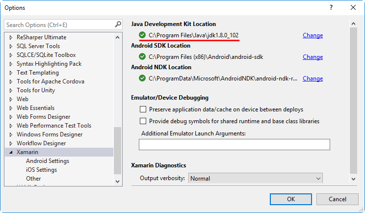

4. Select the emulator you want to run this app on and click on green triangle to run the application.

	

5. You should see the following main screen in your emulator:

	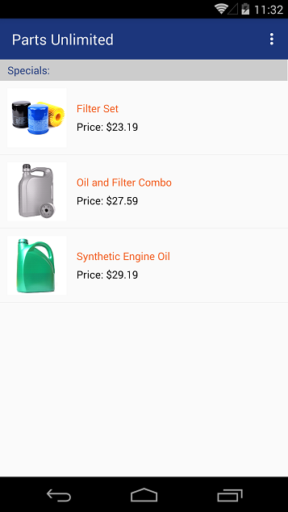

> **Note:** Similarly, you should be able to run this application on UWP and iOS platforms.


### Task 3: Adding feature flag to the mobile app ###

In this task you will add a feature flag that increases discount for all products that are on special.

**Step 1.** Let's add a bool variable which will be accessible everywhere within the application and represent whether feature flag is enabled.

1. If you are still running the application then stop it by clicking on the red square in Visual Studio's tool bar or by pressing `Shift+F5`.

	

2. Open "GlobalResources" class located at <b>`PartsUnlimited` > `Resources` > `GlobalResources.cs` </b>.

	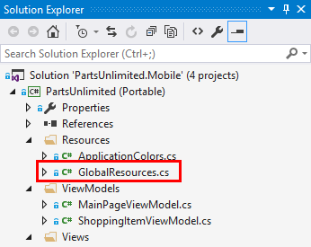

3. Add the following code:

	```csharp
	...
	private bool _enableDiscountFeatureFlag;
	public bool EnableDiscountFeatureFlag
	{
	    get { return _enableDiscountFeatureFlag; }
	    set
	    {
	        _enableDiscountFeatureFlag = value;
	        OnPropertyChanged(nameof(EnableDiscountFeatureFlag));
	    }
	}
	...
	```
	
4. Change the value of `Website` variable to match the URL of your existing deployment of the PartsUnlimited website in Azure, e.g. http://pudncore.azurewebsites.net


**Step 2.** The bool property you defined in the previous step, should be able to be set by a user, so let's add a switch to the settings page.

1. Open "SettingsPage.xaml" file located at <b>`PartsUnlimited` > `Views`</b>.

	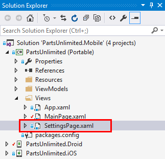

2. Replace the whole "TableView" section with the following code:

	```csharp
	...
	<TableView Intent="Settings">
		<TableSection Title="General">
			<TextCell Text="Website" Detail="{Binding Website, Source={x:Static resources:GlobalResources.Current}}"/>
			<SwitchCell On="{Binding EnableDiscountFeatureFlag, Source={x:Static resources:GlobalResources.Current}}" Text="Extra Discount Feature Flag"/>
		</TableSection>
	</TableView>
	...
	```
	> **Note:** SwitchCell is bound to the bool property you defined before, i.e. this switch will update that property every time its value is changed.

**Step 3.** The last thing left to do is to define what this feature toggle should control/change. In this case, it will add extra 5% of discount to each product.

1. Open "ShoppingItemViewModel.cs" file located at <b>`PartsUnlimited` > `ViewModels`</b>.

 	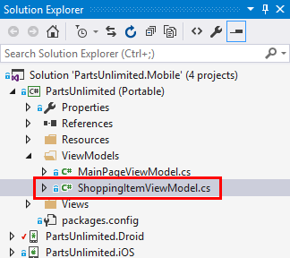

2. Update "DiscountPercentage" property in the following way:

	```csharp
	...
	/// <summary>
	/// Gets or sets the discount percentage.
	/// </summary>
	public decimal DiscountPercentage
	{
		get { return GlobalResources.Current.EnableDiscountFeatureFlag ? _discountPercentage + 5 : _discountPercentage; }
		set
		{
			_discountPercentage = value;
			OnPropertyChanged(nameof(DiscountPercentage));
			OnPropertyChanged(nameof(PriceAfterDiscount));
		}
	}
	...
	```


### Task 4: Validate that feature flag is operational ###

**Step 1.** Run the application again. Note the products' prices before discount is increased. Now, click on ellipsis (`...`), then on the "Settings" option to navigate to the "Settings" page.

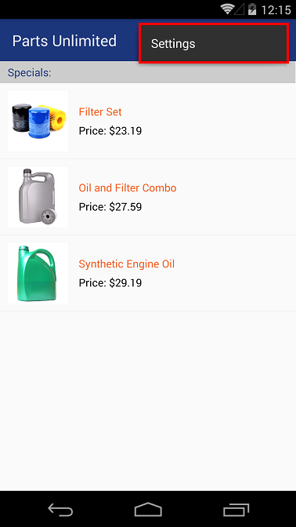

**Step 2.** Turn on the feature flag and navigate back to the "Main" page.

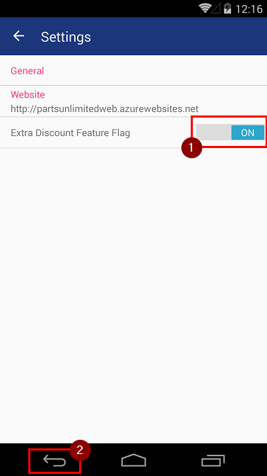

**Step 3.** You can now observe the feature flag in action.

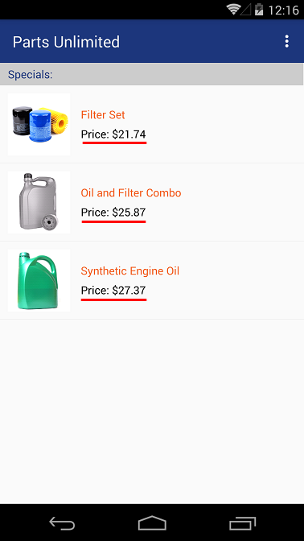

>**Note:** By clicking on the product, the app will navigate you to the website specified in the `GlobalResource.cs` file.


## Congratulations, you have completed this lab.

In this lab, you have learned how to define your own feature flag in a Xamarin Forms mobile app and how to bind a ViewModel's property to achieve the desired outcome. Remember that feature flags can be as simple or as complicated as you wish them to be and even managed outside of your app by a service like [LaunchDarkly](https://launchdarkly.com/).
